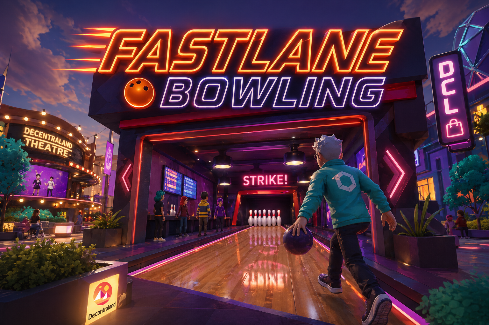
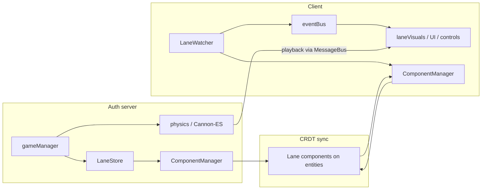

## `dcl-bowling`

# Decentraland Bowling: Fastlane

This is the repository for the Decentraland bowling game *Fastlane*, which you can play here: [fastlane.dcl.eth](decentraland://?realm=stom.dcl.eth)

You will need the [Decentraland Client](https://decentraland.org/) installed to play.

This experience uses the new [Authoritative Servers](https://docs.decentraland.org/creator/scenes-sdk7/networking/authoritative-servers) extensively to synchronise gameplay and organise matches. Bowling physics are simulated with [Cannon-ES](https://github.com/pmndrs/cannon-es) on the authoritative server and then sent out to clients, to ensure all clients see the same animation.

See also: [Bowling Visualiser](#bowling-physics-sandbox)

---

## Contents

- [Repository Overview](#repository-overview)
  - [Code structure](#code-structure)
  - [How the scene works](#how-the-scene-works)
  - [Server-authoritative physics](#server-authoritative-physics)
  - [Bowling physics sandbox](#bowling-physics-sandbox)
- [Development notes](#development-notes)
- [Deployment](#deployment)
- [Getting Started](#getting-started)
  - [Pre-requisites](#pre-requisites)
  - [Preview the DCL scene](#preview-the-dcl-scene)
- [License](#license)

---

## Repository Overview

This repository is split into the following folders:

- `/assets` — source assets and textures before export to `glTF`. Includes Blender and FBX files, plus full-size source textures.
  - `/assets/fonts` — custom fonts
  - `/assets/images` — Affinity source files for UI images
  - `/assets/models` — source Blender/glTF files per model, including full-res textures
  - `/assets/sfx` — raw WAV files for sound effects
  - `/assets/textures` — asset-agnostic textures used across the scene
- `/config` — import/export settings, UVPackMaster presets, shader templates, etc.
- `/dcl` — the DCL scene to deploy. Exported glTF files live in `/dcl/models` with optimised textures in `/dcl/assets/models/tex`
- `/docs` — supplementary notes (e.g. asset creation, dependency updates)
- `/reference` — screenshots, previs, and reference images from production
- `/scripts` — bash, Blender, and batch utility scripts

### Code structure

All scene code lives in `/dcl/src`. The entry point (`/dcl/index.ts`) branches on `isServer()` and calls either `initServer()` or `initClient()`.

| Folder | Role |
|--------|------|
| `/dcl/src/client` | Client-only logic: UI, lane visuals, input, camera, audio, `LaneWatcher`, etc. |
| `/dcl/src/server` | Auth-server logic: match flow (`gameManager`), messaging, and Cannon-ES physics |
| `/dcl/src/shared` | Code used by both sides: lane components, `ComponentManager`, `LaneStore`, types, utilities |

Notable modules (non-exhaustive):

- **`shared/components/`** — ECS component definitions (`lane.ts`) and `ComponentManager` (entity lifecycle and sync)
- **`shared/laneStore.ts`** — read/write API over lane component data
- **`shared/room.ts`** — typed MessageBus messages for actions that do not fit on synced components (e.g. roll playback payloads)
- **`shared/utils/eventBus.ts`** — in-scene pub/sub (see below)
- **`server/gameManager.ts`** — authoritative game state machine per lane
- **`server/physics/`** — Cannon simulation, keyframe recording, and compression (see [Server-authoritative physics](#server-authoritative-physics))
- **`client/laneWatcher.ts`** — watches synced lane components and drives client-side events
- **`client/laneVisuals.ts`**, **`client/bowlingControls.ts`**, **`client/gameStateHandler.ts`** — playback, input, and high-level client reactions

More detail on the physics module alone is in [`dcl/src/server/physics/README.md`](dcl/src/server/physics/README.md).

### How the scene works

This is a skim-level guide, not a tutorial. The goal is a decoupled layout: new features can hook into existing flows without rewriting the core each time.

**Authoritative server and synced components**

Game state for each bowling lane is stored on dedicated ECS entities. On the server, `ComponentManager` creates one entity per lane, seeds default component values, and registers them with `syncEntity` so clients receive updates over CRDT sync. Server-only validation prevents clients from mutating that data directly.

`LaneStore` is the data-access layer: it reads and writes the lane components (`LanePhaseEnum`, `LaneCurrentTurn`, `LaneGameData`, `LaneScores`) through `ComponentManager.getLaneEntity()`. Writes are server-only; the client treats component data as read-only truth from the auth server.

`ComponentManager` intentionally does not contain game rules — only entity lifecycle, sync setup, and lookup. Domain logic stays in `LaneStore`, `gameManager`, and client modules. Dependency flows one way: `LaneStore` → `ComponentManager`.

**`LaneWatcher` and the local `eventBus`**

On the client, `LaneWatcher` attaches `onChange` listeners to each lane’s synced components. When something changes, it coalesces updates per tick and builds a `LaneSnapshot`, then emits on the **local** `eventBus` (`shared/utils/eventBus.ts`).

That bus is an in-process pub/sub layer (similar to Roblox *BindableEvents*). It is **not** Decentraland’s built-in MessageBus used for peer-to-peer messages. Use `eventBus` to decouple scripts: UI, camera, controls, and visuals subscribe to `ClientEvents` (e.g. `NOTIFY_LANE_STATE`, `ON_MY_ROLL_START`) instead of calling each other directly.

Peer actions and bulky payloads still use **`room`** / MessageBus (`shared/room.ts`) — for example join-game requests, roll input, and compressed physics playback — where CRDT components are the wrong fit or size limits apply.

**Rough data flow**

### Server-authoritative physics

Roll outcomes are simulated on the server with Cannon-ES, not on each client. That keeps gameplay consistent and avoids trusting client physics.

Each roll produces dense keyframe tracks (ball and pins over time). Those tracks are **reduced and compressed** before send — redundant keyframes are dropped, rotations are stored in a compact wire format, and further optimisation runs in `physics.keyframe-optimization.ts` so payloads stay within Decentraland’s practical message size limits. Clients replay the compressed keyframes in `laneVisuals` rather than re-simulating.

Tuning and pipeline detail: [`dcl/src/server/physics/README.md`](dcl/src/server/physics/README.md).

### Bowling physics sandbox

While building Fastlane, a separate standalone tool was put together to iterate on the bowling simulation, inspect keyframes, and measure compression — without running the full DCL scene.

- **Repository:** [github.com/dcl-bowling-visualiser](https://github.com/stom66/dcl-bowling-visualiser/)
- **Live demo:** [stom66.github.io/dcl-bowling-visualiser](https://stom66.github.io/dcl-bowling-visualiser/)

Replace the URL when the repo is published. The physics code under `dcl/src/server/physics/` is designed to be portable; the sandbox is the easiest place to experiment with rolls and wire-size tradeoffs.

---

## Development notes

**AI assistance**

Cursor and other AI tools were used during development, but this is predominantly **human-designed and human-written** code. Layout, decoupling, and what *not* to add were planned deliberately — avoiding the usual AI-driven bloat was a priority, as was a structure that can grow without a rewrite every time a feature lands.

**On the architecture**

This layout is not presented as perfect or prescriptive. It has worked well as a starting point for an authoritative multiplayer bowling scene. If something looks wrong or could be simpler, suggestions and PRs are welcome.

---

## Deployment

Deployments are handled by GitHub Actions under [`.github/workflows/`](.github/workflows/). Each workflow checks out the `dcl` scene, builds it, and deploys with the usual Decentraland CLI flow (production, testing, and world targets each have their own workflow).

One small extra step runs before every deploy: the action writes [`dcl/src/client/data/version.ts`](dcl/src/client/data/version.ts) with a string like `v-202605271430-a1b2c3d` — build timestamp plus short commit hash. That value is shown in the bottom-right corner of the UI ([`VersionUI`](dcl/src/client/ui-screen/layers/version.tsx)), so when you visit the live scene you can tell at a glance whether you are on the build you expect. There is nothing to remember or bump by hand; each deploy refreshes it automatically.

---

## Getting Started

### Pre-requisites

**Previewing the scene**

- [Decentraland Creator Hub](https://decentraland.org/download/creator-hub/) — launch and host the scene
- [Decentraland Client](https://decentraland.org/download/) — join and view the scene

### Preview the DCL scene

#### First-time setup

1. Launch the Decentraland Creator Hub
2. Open the **Scenes** tab
3. Choose **Import Scene**
4. Select the `dcl` folder inside this repository

#### Normal use

1. Launch the Decentraland Creator Hub
2. Open the scene from the home screen
3. Choose **Preview**
4. A local test server starts and the Decentraland Client opens

---

## License

This work is licensed under the [Creative Commons Attribution-NonCommercial-NoDerivatives 4.0 International License](http://creativecommons.org/licenses/by-nc-nd/4.0/). See the license file in this repository.
