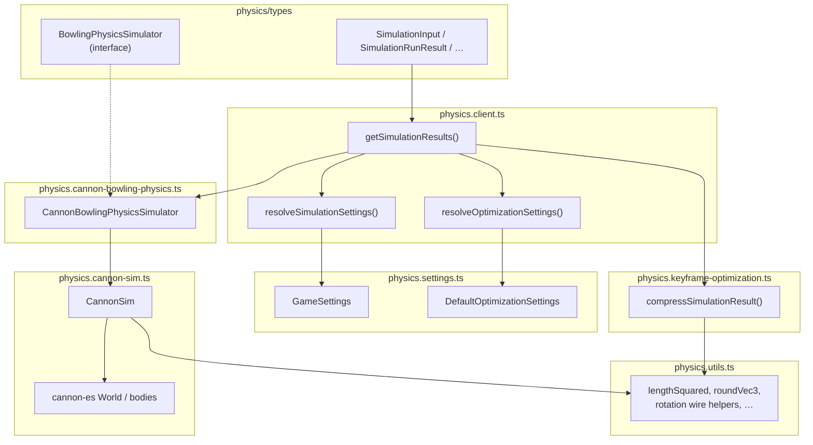
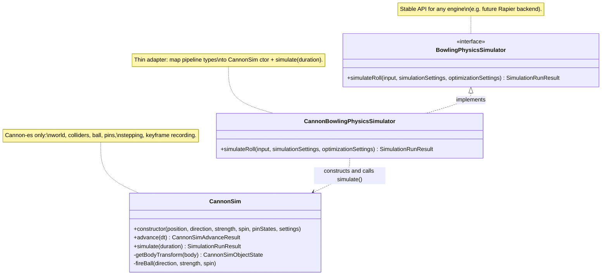
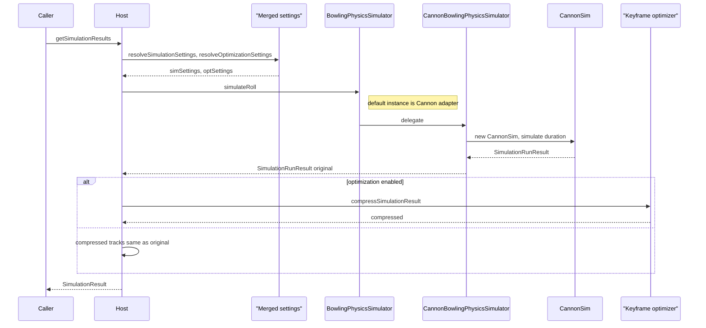

# Bowling physics module

Portable **Cannon-es** roll simulation, optional keyframe reduction, and DCL-friendly types. Treat **`src/bowling/physics/`** as one copyable unit: it includes **`types/`** (contracts + re-exports from `@dcl`), **`colliders/*.json`**, and the TypeScript modules below.

A project-level companion lives at the repo root: [`REINTEGRATION.md`](../../../REINTEGRATION.md). The two guides match; keep **this** file when you only copy the `physics` folder into another tree.

---

## Reintegration (other TypeScript / DCL project)

### 1. What to copy (minimum: sim + compression)

| Item | Role |
|------|------|
| This whole `physics/` directory | `getSimulationResults` entry (`physics.client.ts`), `CannonSim`, keyframe optimizer, **types**, **JSON colliders** |

**Entry API:** `physics.client.ts` — `getSimulationResults`, `resolveSimulationSettings`, `resolveOptimizationSettings`, `DEFAULT_SIMULATION_INPUT`.

**Types:** `types/bowling-sim.ts` defines `SimulationResult` (return of `getSimulationResults`), `SimulationRunResult` (one physics or compression path), `SimulationSettings`, `OptimizationSettings`, `BowlingPhysicsSimulator`, etc. `types/index.ts` re-exports those plus `Quaternion` / `Vector3` types from `@dcl/ecs` and `@dcl/sdk/math` (same as this visualiser).

**Colliders:** `colliders/lane-colliders.json`, `colliders/pin-colliders.json`, `colliders/bumper-colliders.json` — pin rack layout (and pin cylinder authoring) comes from `physics.pin-layout.ts` reading `pin-colliders.json`; `physics.cannon-sim.ts` loads lane and bumper JSON. Keep the `colliders/` folder next to these modules.

### 2. Optional: visualizer and UI (not required for `getSimulationResults`)

- `src/bowling/visualizer/` — playback sampling, ECharts model, wire-size helpers. Imports use `src/bowling/physics/...` in this repo; in your project, point imports at your new paths or a path alias.
- `BowlingSimVisualizer.vue`, `BowlingThreeViewport.vue` — full debug UI (Vue 3 + Three + ECharts).

If you only need **keyframes and metrics** for your own renderer, you can omit `visualizer/` and the Vue components.

### 3. npm dependencies

Align versions with this repo’s `package.json` where possible:

| Package | Why |
|---------|-----|
| **`cannon-es`** | Physics engine |
| **`@dcl/sdk`** | `Quaternion`, `Vector3` math and types used by `physics.cannon-sim.ts`, `physics.utils.ts`, and `types/index.ts` |

If you use `visualizer/` message-bus / wire-size code, you also need **`@dcl/sdk`** (ECS / serialization) as in this project.

**Three.js / Vue / ECharts** are only for the bundled UIs, not for `getSimulationResults`.

### 4. TypeScript and bundler

- Set **`"resolveJsonModule": true`** so `import ... from './colliders/*.json'` resolves.
- This app maps **`"src/*"` → `./src/*`** in `tsconfig.app.json`. If you do not use that pattern, change imports in copied files to **relative** paths (the physics modules already use relative imports among themselves) or add your own `paths` alias.
- If `@dcl/*` resolution differs in your host project, adjust **`types/index.ts`** (or split SDK re-exports) so `Quaternion` / `Vector3` match your runtime.

### 5. Usage sketch

```ts
import {
	getSimulationResults,
	DEFAULT_SIMULATION_INPUT,
} from './physics.client'

// Optional overrides; defaults: physics.settings.ts / DefaultOptimizationSettings.
// Third arg: set keyframeOptimizationEnabled: false to skip reduction (compressed === original).
const { original, compressed } = getSimulationResults(
	{ ...DEFAULT_SIMULATION_INPUT, strength: 0.9 },
	{ simFrameRate: 60, simSubSteps: 3 },
	{ keyframeRdpMaxPositionErrorM: 0.01 },
	// new MyPhysicsSimulator() // optional 4th arg; default is CannonBowlingPhysicsSimulator
)
// `compressed` (or `original` if optimization off) is ready to serialize.
```

### 6. After moving files

- Search for old path prefixes (e.g. `src/bowling/...`) and update to your layout or alias.
- Run `tsc` / build: fix JSON imports and path aliases first, then any DCL type shims.

---

## File cheat sheet

| File | Role |
|------|------|
| `physics.client.ts` | Host API: `getSimulationResults`, defaults, merge helpers. |
| `physics.settings.ts` | Default values `GameSettings`, `DefaultOptimizationSettings` (types from `./types`). |
| `types/bowling-sim.ts` | Simulation contracts: inputs, results, `BowlingPhysicsSimulator`, settings types. |
| `types/index.ts` | Re-exports from `bowling-sim` + `@dcl/ecs` / `@dcl/sdk/math`. |
| `physics.cannon-bowling-physics.ts` | **Adapter**: implements `BowlingPhysicsSimulator` → `CannonSim`. |
| `physics.cannon-sim.ts` | **Engine**: Cannon world, colliders, stepping, keyframe recording. |
| `physics.utils.ts` | Engine-agnostic math and rotation wire-format helpers. |
| `physics.keyframe-optimization.ts` | Keyframe reduction after simulation (optional). |
| `physics.pin-layout.ts` | `PIN_LANE_LOCAL_POSITIONS` and `pinCollidersConfig` from `pin-colliders.json` (any engine can share the same rack / collider data). |
| `colliders/*.json` | Lane / pin / bumper static collider data. |

`simulateRoll` takes `optimizationSettings` so every backend shares the same call shape; Cannon ignores optimizer tunables during integration, and the client runs compression **after** `simulateRoll` when enabled.

---

## Module dependency (data flow)



---

## Class / interface roles



---

## One `getSimulationResults()` call (sequence)

Mermaid is picky about dots in participant IDs and about `alt` nesting; this version uses plain IDs (see labels below).



| ID in diagram | Code |
|---------------|------|
| Host | `physics.client.ts` (`getSimulationResults`) |
| R | `resolveSimulationSettings` + `resolveOptimizationSettings` |
| I | Interface `BowlingPhysicsSimulator` (parameter or default) |
| A | `CannonBowlingPhysicsSimulator` |
| E | `CannonSim` |
| K | `compressSimulationResult` in `physics.keyframe-optimization.ts` |

---

## Pipeline source of truth

**`physics.cannon-sim.ts` + `colliders/*.json` + `physics.keyframe-optimization.ts`** — same stack this visualiser uses for compressed playback tracks. Only the UI layer (Vue / Three / ECharts) is optional for reuse.
